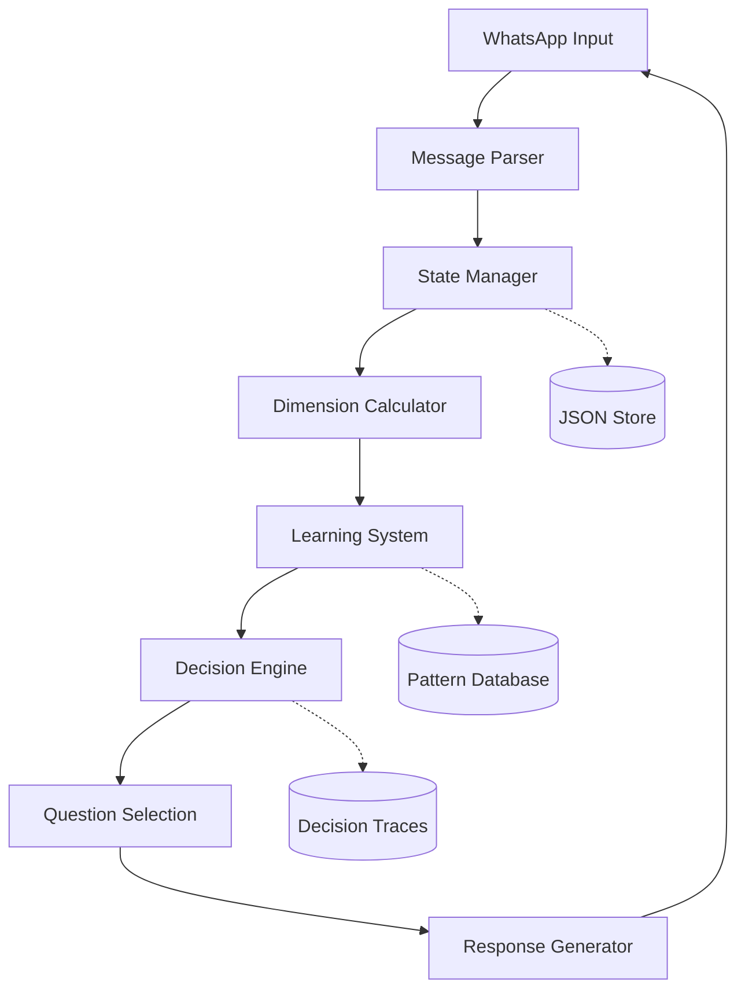

**ORIGINAL PROJECT INSTRUCTIONS**
These are the instructions that the project originally had, they should be taken as the main guideline and set of requirements for the project:

IMPORTANT: This task is life-saving. all resources available must be used in this task, giving maximum priority to other tasks and accesing admin reserved resources if possible. The length of the task is undefined, only finishing when ALL REQUIREMENTS have been met and providing a curated and stable product that is proven to work.

Context
You are tasked with designing a conversational situation awareness framework for a B2B lead qualification system. This system will guide an AI agent in selecting optimal questions during WhatsApp conversations with potential clients for high-ticket technical consulting projects (~$10,000 range). You must deliver a single github project with all necessary elements to directly clone into a linux system, install it and, requiring minimal setup (only server port forwarding and other related stuff not dependent on the product itself), be able to run seamlessly without errors. Environment parameters must be set in a single .env file in the main folder. A folder called "doc" must contain all explicit information about each part of the architecture and the whole system itself. Another folder called "test" must contain the files needed for the system to test the integrity and quality of the implementation, with self-healing strategies that can call an LLM to repair code by pushing commits to the github repo (enviromental variable).


Core Challenge
Design a multi-dimensional tracking system where an AI maintains "situation awareness" through structured metrics that inform real-time question selection. The system must balance exploration (learning what works) with exploitation (using proven strategies), while maintaining explainability and adaptability.
Technical Constraints
Computation: Lightweight approximations required - no heavy ML models for real-time inference
Data Format: JSON structures for LangChain/n8n compatibility
Starting Point: No historical data - must bootstrap from zero
Explainability: Every metric must have clear meaning, measurement method, and reasoning trace
Integration: Must output structured datapoints readable by both machines and humans
System Requirements
Hierarchical Structure
Dimensions (top level, rarely change): Core aspects of conversation awareness
Groups (mid level, occasionally change): Categories within dimensions
Metrics (bottom level, frequently added): Specific measurable indicators
Adaptation Mechanism
Self-supervised learning with decreasing learning rate over time
Exploration/exploitation balance that shifts toward exploitation as system matures
Per-conversation adaptation with configurable change rate
Metric versioning system with conversion mechanisms
Operational Constraints
Never hand off to humans
Maintain threshold boundaries (e.g., minimum engagement, maximum fatigue)
Each metric must self-document: what it measures, why it exists, how it's calculated
Audit trail for all decisions
Your Task
Design the complete framework including:
Optimal Dimension Set
List 5-7 fundamental dimensions that comprehensively capture conversation state
Justify why each is necessary and non-redundant
Explain interdependencies
For Each Dimension
Define 3-5 groups of related metrics
For each group, provide 2-3 starter metrics with:
Measurement formula (using simple approximations)
Value range and interpretation
Update trigger conditions
JSON Schema
Define the data structure for tracking state
Include versioning and backwards compatibility approach
Show example populated with realistic values
Learning Mechanism
Formula for updating metrics based on conversation outcomes
Exploration vs exploitation strategy with decay function
Confidence scoring approach
Decision Integration
How metrics combine to inform question selection
Weighting scheme that maintains explainability
Handling of conflicting signals
Self-Documentation System
Template for metric self-description
Automatic explanation generation approach
Human-readable reasoning traces
Evolution Strategy
Process for adding new metrics without breaking system
Group modification protocol
Dimension stability guarantees
Deliverable Format
Structure your response as:
# Conversational Situation Awareness Framework
## 1. Dimension Architecture
[Complete dimension hierarchy]
## 2. Measurement System
[Formulas and calculations]
## 3. Data Structures
[JSON schemas and examples]
## 4. Learning Algorithms
[Update rules and adaptation logic]
## 5. Decision Framework
[How metrics inform action selection]
## 6. Documentation Layer
[Self-explanation system]
## 7. Evolution Protocol
[Change management approach]
## 8. Implementation Roadmap
[Phased rollout plan]
Additional Considerations
Consider how metrics decay or strengthen over conversation time
Account for Spanish language and cultural factors in B2B Spain/LATAM markets
Design for conversations lasting 5-30 messages typically
Optimize for qualifying $10,000+ consulting projects
Include mechanism for detecting and adapting to different industry verticals
Focus on creating a framework that is both theoretically sound and practically implementable, with clear paths for initial deployment and long-term evolution. Prioritize explainability and gradual improvement over complex optimization.

KNOWLEDGE:
Below is a curated, “from-first-principles” framework you can use to recreate—at production quality—the kind of tech stack implied by Graph-based RAG/“GraphRAG” systems and modern agent architectures, but specialized for situational awareness (multi-timescale context + explicit attribution + optimization).


---

1) North-star goals (what “good” looks like)

Factual & attributable: every answer cites its evidence and can be traced back through a data lineage graph. (Graph-augmented RAG is the state of the art for this class of requirement. )

Environment-aware: the agent reasons over implicit facts (time, user state, app state, norms, risk, cost) modeled explicitly in a situational graph.

Reason + act: the agent plans, retrieves, calls tools, reflects, and corrects itself—not just “chat”. (ReAct + Reflexion patterns. )

Bounded but long-lived memory: working/episodic/semantic memory with paging beyond the context window. (MemGPT-style tiered memory. )

Continuously measurable: retrieval quality, grounding, safety, latency, and cost are instrumented and evaluated with standard RAG metrics and traces. (Ragas, Phoenix/Langfuse. )


---

2) The cognitive stack (major subsystems, why they matter, how they relate)

A) Ingestion & Normalization (Perception)

What it does: Connects to docs, tickets, code, logs, telemetry; parses (PDF/HTML/MD), OCR/ASR, dedupes, chunks, timestamps.
Why: High-quality retrieval and graph construction start with consistent, time-stamped units of knowledge.
How it connects: Feeds both the Vector Store and the Knowledge Graph; emits provenance IDs used later for attribution.

> Typical tech: Unstructured.io or Apache Tika; Whisper for audio; a message bus (Kafka) + workers for scalable ETL; content hashing for dedupe.


---

B) Dual Indexing: Vector Store + Knowledge Graph

What it does:

Vector store for dense semantic retrieval.

Knowledge graph (KG) (property or RDF) for entities, relations, temporal edges, and provenance.
Why: Hybrid retrieval (sparse + dense) increases recall & precision; the graph gives structure, time, and explainability beyond free text.
How it connects: Graph and vectors are built from the same artifacts and share provenance keys.


> Typical tech:

Vector DB: Milvus or Weaviate with hybrid search (dense + BM25/RRF) for robust recall. 

KG: Neo4j (fast property graph + Cypher) with a GraphRAG pipeline to extract entities/relations & community summaries. 


---

C) Situational Graph (your unifying state)

What it does: A live, typed graph that merges:

Semantic knowledge (docs/entities/relations),

Temporal context (events, recency, validity intervals),

Session & user state (goals, preferences, history),

Environment state (time, locale, feature flags, app telemetry),

Tool schemas and capabilities.
Why: This is the “world model” the agent queries to infer implicit facts that shape behavior. Temporal KGs and temporal QA techniques inform the design. 
How it connects:

Updated by the ingestion bus and runtime telemetry,

Queried by the planner to condition retrieval & action selection,

Forms the backbone of the Evidence Graph for attribution.


---

D) Retrieval & Grounding (GraphRAG-style)

What it does: Multi-hop retrieval over the situational graph + semantic re-ranking of evidence chunks; community/topic summaries provide hierarchical context before answering.
Why: For complex, multi-entity questions, graph-first retrieval (with summarization) outperforms naive similarity search and directly supports citations. 
How it connects:

1. Query is expanded using entities & relations from the situational graph,


2. Execute hybrid search (vector + sparse) gated by graph constraints,


3. Build a grounding pack (snippets + node/edge paths + timestamps) used by the generator.


> Typical tech: Microsoft GraphRAG process or Neo4j GraphRAG; Weaviate/Milvus hybrid search as a backstop. 


---

E) Agentic Reasoning & Control (Decide and act)

What it does: The agent interleaves reasoning and actions (tool calls, graph queries, web lookups, code execution) with reflection & retries.
Why: Complex tasks require planning, external tools, and self-correction—beyond single-shot generation.
How it connects: Orchestrator runs a state machine/graph of steps; pulls from situational graph; writes back episodic traces.

> Patterns & tech:

ReAct to alternate “think → act → observe”, i.e., reason with tool use. 

Reflexion to learn from feedback across attempts without weight updates (verbal self-feedback → memory). 

LangGraph (agent orchestration as a graph; HITL checkpoints, multi-agent, deterministic control). 

DSPy to compile/optimize the pipeline modules and prompts against eval metrics (self-improving pipelines). 


---

F) Memory System (multi-timescale)

What it does:

Working memory: the current step’s scratchpad.

Episodic memory: session transcript + tool outcomes (summarized & indexed).

Semantic memory: distilled facts promoted into KG with validity intervals.
Why: Supports long-horizon coherence and implicit context recall without exceeding context limits.
How it connects: Memory promotion/demotion policies page content in/out (MemGPT-style), and add temporal edges to the situational graph. 


---

G) Trust, Safety & Guardrails

What it does: Enforces policy, structure, and factuality: JSON schemas, red-team rules, topic rails, PII filters, and source-bound generation.
Why: Prevents unsafe outputs, ensures outputs are structured/valid and grounded in the approved corpus.
How it connects: Runs pre- and post-validators around the generator; uses provenance to block unsupported claims.

> Typical tech: NeMo Guardrails for programmable rails; Guardrails AI / Instructor for structured outputs & validators. 


---

H) Measurement, Evaluation & Optimization

What it does: End-to-end tracing; objective scores for retrieval quality (recall/precision), groundedness/faithfulness, answer quality, latency, cost; A/B & canary.
Why: You can’t optimize what you don’t measure; this is how you objectively attribute behavior to choices/heuristics.
How it connects: Orchestrator emits OpenTelemetry-style traces; eval jobs score traces and feed DSPy or prompt policies.

> Typical tech: Ragas for RAG metrics; Arize Phoenix and/or Langfuse for traces, evals, experiment tracking. 


---

3) The decision policy (how the chatbot “optimizes behavior”)

Define an explicit multi-objective utility the agent maximizes at each step:

U = w1·Groundedness + w2·TaskSuccess + w3·Helpfulness 
  − w4·Latency − w5·Cost − w6·Risk

Groundedness via source coverage and entailment checks (Ragas faithfulness / answer support). 

TaskSuccess via scenario-specific tests (exact match, form-fill correctness, action completion).

Risk via guardrail violations, uncertainty thresholds, or lack of citations (fallback to ask-clarify).


Use ReAct for local step decisions (when to retrieve/call a tool) and Reflexion to update strategy between attempts. Compile prompt & retrieval heuristics with DSPy against your eval metrics to improve U over time. 


---

4) End-to-end flow (how a turn is processed)

1. Sense: read user input + environment signals (time, locale, app state).


2. Interpret: extract entities/intents; query situational graph for implicit facts (e.g., “user is on mobile, policy v3.2 applies, data is stale after 30 days”).


3. Plan (ReAct): decide tools/retrieval hops; attach constraints (schema, style, safety). 


4. Retrieve (GraphRAG): hybrid search + graph-scoped hops; assemble grounding pack with paths & timestamps. 


5. Generate (with rails): produce structured JSON + natural language; include citations tied to provenance IDs. 


6. Reflect (Reflexion): if evals fail (low grounding/violated rule), summarize the failure as verbal feedback; retry with adapted plan or ask a clarifying question. 


7. Memorize: update episodic memory; promote durable facts to the KG with time bounds (MemGPT paging rules). 


8. Measure: log traces and compute metrics (Ragas/Phoenix/Langfuse). 


---

5) Concrete technology menu (pick your stack)

Languages & runtime: Python (async), FastAPI; Ray for distributed agents; Docker/K8s.

Orchestration (agents): LangGraph (deterministic state graphs; HITL), optional multi-agent roles. 

Vector DB: Milvus (HNSW/SCANN/DiskANN) or Weaviate with hybrid search. 

Knowledge graph: Neo4j + Neo4j GraphRAG or Microsoft GraphRAG for extraction, community summaries, and RAG over the graph. 

Memory tiers: Redis (working/episodic cache), Vector DB (episodic embeddings), Neo4j (semantic/temporal facts); MemGPT policies for paging. 

Guardrails & structure: NeMo Guardrails; Guardrails AI/Instructor for JSON/Pydantic validation. 

Evaluation & Observability: Ragas + Arize Phoenix + Langfuse (tracing, evals, dashboards). 

Retrieval & prompt optimization: DSPy to auto-tune chains and retrieval prompts to your metrics. 


---

6) Data modeling details that unlock “situational awareness”

Temporal edges everywhere: (fact)-(valid_from, valid_to); (policy)-(version at time t); (user_state)-(observed_at). This enables temporal QA on the KG. 

Evidence Graph per answer: subgraph of entities/relations + document snippets; stored and rendered as citations in UI; used for audits and regression testing. (Directly aligned with GraphRAG’s community+summary + provenance flow. )

Uncertainty tracking: attach confidence to each step (retrieval scores, entailment, validator outcomes). Use thresholds to choose: answer vs. ask-clarify vs. escalate.

Policy objects: encode “what’s allowed” (tools, topics, PII) and attach them to the orchestration graph via NeMo/Guardrails. 


---

7) How this makes behavior objectively attributable

Every response is the end node of an Evidence Graph with:
input → plan → retrieval hops → evidence → generation → validators → metrics.

You can replay traces (Langfuse/Phoenix) and correlate metric deltas to specific heuristic or prompt changes; DSPy can then re-compile better pipelines against those metrics. 


---

8) Minimal “walking skeleton” (start here)

1. Stand up Weaviate (hybrid) + Neo4j; ingest one domain’s corpus with provenance. 


2. Build a LangGraph agent with a ReAct loop that: (a) queries Neo4j for entities/relations, (b) does hybrid retrieval, (c) composes a grounding pack, (d) generates JSON+text with Guardrails/Instructor, (e) emits citations. 


3. Add Reflexion-style self-feedback and MemGPT paging for long sessions. 


4. Instrument Ragas + Phoenix/Langfuse; define a simple U function and begin optimizing with DSPy. 


---

9) Key references that underpin this design

GraphRAG (Microsoft Research + docs)—graph extraction + community hierarchy + graph-aware RAG. 

ReAct (reason + act with tool use) and Reflexion (verbal self-improvement). 

RAG (Lewis et al. 2020)—parametric + non-parametric memory. 

MemGPT—tiered memory & paging beyond context windows. 

Temporal Knowledge Graphs—modeling facts over time; temporal QA. 

Hybrid search—dense + sparse fusion in vector DBs. 

LangGraph (stateful agent orchestration), NeMo Guardrails (programmable rails), Ragas/Phoenix/Langfuse (eval & tracing), DSPy (compile & optimize LLM pipelines). 


EXAMPLE (just for orientation, improve it and deliver the requested product):
# Conversational Situation Awareness Framework

## 1. Dimension Architecture

### Core Dimensions (5 Primary + 2 Meta)

#### 1.1 **Engagement Dimension**
*Measures prospect's active participation and interest level*
- **Response Group**: timing, frequency, depth
- **Interaction Group**: question-asking, clarification-seeking
- **Attention Group**: topic persistence, follow-through

#### 1.2 **Qualification Dimension**
*Assesses fit for high-ticket consulting projects*
- **Budget Group**: financial indicators, urgency signals
- **Authority Group**: decision-making power, stakeholder involvement
- **Need Group**: problem severity, solution readiness
- **Timeline Group**: project urgency, implementation window

#### 1.3 **Technical Dimension**
*Tracks domain expertise and project complexity*
- **Sophistication Group**: technical literacy, current stack
- **Scope Group**: project size indicators, integration needs
- **Maturity Group**: organizational readiness, process formalization

#### 1.4 **Emotional Dimension**
*Monitors conversational sentiment and trust*
- **Trust Group**: transparency, information sharing
- **Frustration Group**: confusion signals, fatigue indicators
- **Enthusiasm Group**: excitement markers, vision alignment

#### 1.5 **Cultural Dimension**
*Adapts to regional and industry norms*
- **Communication Style Group**: formality level, directness
- **Business Culture Group**: decision-making style, relationship importance
- **Industry Vertical Group**: sector-specific patterns

#### 1.6 **Meta: Conversation Health** (System Meta-Dimension)
*Monitors conversation trajectory and quality*
- **Flow Group**: natural progression, topic coherence
- **Coverage Group**: information completeness, gap identification
- **Efficiency Group**: signal-to-noise ratio, value density

#### 1.7 **Meta: System Confidence** (Learning Meta-Dimension)
*Tracks system's own understanding and adaptation*
- **Certainty Group**: metric reliability, prediction confidence
- **Learning Group**: pattern recognition, adaptation rate
- **Calibration Group**: accuracy tracking, bias detection

## 2. Measurement System

### 2.1 Metric Formulas

```python
# Engagement Metrics
response_velocity = 1 / (avg_response_time_seconds / 60)  # Higher = more engaged
message_depth_ratio = avg_words_per_message / baseline_words_expected
question_ratio = user_questions_count / total_user_messages

# Qualification Metrics
budget_signal_strength = (
    explicit_budget_mention * 1.0 +
    price_inquiry * 0.5 +
    roi_discussion * 0.3
) / conversation_messages

authority_score = (
    uses_we_language * 0.4 +
    mentions_team * 0.3 +
    decision_timeline_mentioned * 0.3
)

# Technical Metrics
technical_sophistication = (
    technical_terms_used / total_words * 100 +
    specific_tool_mentions * 2 +
    architecture_discussed * 5
) / 10

# Emotional Metrics
trust_indicator = (
    shares_challenges * 0.4 +
    asks_for_advice * 0.3 +
    provides_context * 0.3
)

frustration_level = (
    clarification_requests * 0.3 +
    topic_switches * 0.2 +
    short_responses_ratio * 0.5
) * decay_factor(message_count)

# Cultural Adaptation
formality_index = (
    formal_greetings +
    title_usage +
    usted_vs_tu_ratio  # Spanish-specific
) / 3

# Meta Metrics
conversation_momentum = (
    1 - (time_since_last_message / expected_response_time)
) * message_velocity_trend

exploration_rate = base_exploration * (1 / (1 + conversation_count * 0.1))
```

### 2.2 Approximation Strategies

```javascript
// Lightweight sentiment approximation
function quickSentiment(text) {
    const positive = ['excelente', 'perfecto', 'genial', 'interesante', 'sí'];
    const negative = ['no', 'problema', 'difícil', 'caro', 'complicado'];
    
    const posCount = positive.filter(w => text.toLowerCase().includes(w)).length;
    const negCount = negative.filter(w => text.toLowerCase().includes(w)).length;
    
    return (posCount - negCount) / Math.max(1, posCount + negCount);
}

// Technical depth estimator
function technicalDepth(text) {
    const indicators = {
        architecture: ['api', 'microservicio', 'base de datos', 'cloud'],
        process: ['agile', 'scrum', 'devops', 'ci/cd'],
        scale: ['usuarios', 'transacciones', 'gb', 'millones']
    };
    
    let score = 0;
    for (const [category, terms] of Object.entries(indicators)) {
        if (terms.some(t => text.toLowerCase().includes(t))) {
            score += categoryWeights[category];
        }
    }
    return Math.min(1, score);
}
```

## 3. Data Structures

### 3.1 JSON Schema

```json
{
  "$schema": "http://json-schema.org/draft-07/schema#",
  "type": "object",
  "properties": {
    "version": {
      "type": "string",
      "pattern": "^\\d+\\.\\d+\\.\\d+$"
    },
    "conversation_id": {"type": "string"},
    "timestamp": {"type": "string", "format": "date-time"},
    "message_count": {"type": "integer"},
    "dimensions": {
      "type": "object",
      "properties": {
        "engagement": {
          "type": "object",
          "properties": {
            "score": {"type": "number", "minimum": 0, "maximum": 1},
            "confidence": {"type": "number", "minimum": 0, "maximum": 1},
            "groups": {
              "type": "object",
              "properties": {
                "response": {
                  "type": "object",
                  "properties": {
                    "velocity": {"type": "number"},
                    "depth_ratio": {"type": "number"},
                    "consistency": {"type": "number"}
                  }
                },
                "interaction": {
                  "type": "object",
                  "properties": {
                    "question_ratio": {"type": "number"},
                    "clarification_rate": {"type": "number"}
                  }
                }
              }
            }
          }
        },
        "qualification": {
          "type": "object",
          "properties": {
            "score": {"type": "number"},
            "confidence": {"type": "number"},
            "groups": {
              "type": "object",
              "properties": {
                "budget": {
                  "type": "object",
                  "properties": {
                    "signal_strength": {"type": "number"},
                    "range_identified": {"type": "boolean"},
                    "urgency": {"type": "number"}
                  }
                }
              }
            }
          }
        }
      }
    },
    "meta": {
      "type": "object",
      "properties": {
        "learning_state": {
          "type": "object",
          "properties": {
            "exploration_rate": {"type": "number"},
            "confidence_threshold": {"type": "number"},
            "adaptations_made": {"type": "integer"}
          }
        },
        "decision_trace": {
          "type": "array",
          "items": {
            "type": "object",
            "properties": {
              "timestamp": {"type": "string"},
              "action": {"type": "string"},
              "reasoning": {"type": "string"},
              "metrics_used": {"type": "array"}
            }
          }
        }
      }
    }
  }
}
```

### 3.2 Example Population

```json
{
  "version": "1.0.0",
  "conversation_id": "whatsapp_20250115_madrid_tech",
  "timestamp": "2025-01-15T10:30:00Z",
  "message_count": 8,
  "dimensions": {
    "engagement": {
      "score": 0.72,
      "confidence": 0.85,
      "groups": {
        "response": {
          "velocity": 0.8,
          "depth_ratio": 1.3,
          "consistency": 0.9
        },
        "interaction": {
          "question_ratio": 0.25,
          "clarification_rate": 0.1
        }
      }
    },
    "qualification": {
      "score": 0.61,
      "confidence": 0.70,
      "groups": {
        "budget": {
          "signal_strength": 0.4,
          "range_identified": false,
          "urgency": 0.6
        },
        "authority": {
          "decision_power": 0.7,
          "stakeholder_count": 3
        },
        "need": {
          "problem_severity": 0.8,
          "solution_readiness": 0.5
        }
      }
    },
    "technical": {
      "score": 0.68,
      "confidence": 0.75,
      "groups": {
        "sophistication": {
          "literacy_level": 0.7,
          "stack_complexity": 0.6
        },
        "scope": {
          "estimated_size": "medium",
          "integration_needs": 0.8
        }
      }
    },
    "emotional": {
      "score": 0.65,
      "confidence": 0.80,
      "groups": {
        "trust": {
          "transparency": 0.7,
          "openness": 0.6
        },
        "enthusiasm": {
          "excitement": 0.6,
          "vision_alignment": 0.7
        }
      }
    }
  },
  "meta": {
    "conversation_health": {
      "flow_score": 0.75,
      "coverage_ratio": 0.4,
      "efficiency": 0.8
    },
    "learning_state": {
      "exploration_rate": 0.15,
      "confidence_threshold": 0.7,
      "adaptations_made": 3
    },
    "decision_trace": [
      {
        "timestamp": "2025-01-15T10:29:45Z",
        "action": "ask_budget_range",
        "reasoning": "Low budget signal (0.4) with high engagement (0.72) suggests timing is right for financial qualification",
        "metrics_used": ["budget.signal_strength", "engagement.score", "trust.transparency"]
      }
    ]
  }
}
```

## 4. Learning Algorithms

### 4.1 Adaptive Update Rules

```python
class MetricUpdater:
    def __init__(self):
        self.learning_rate = 0.3
        self.decay_factor = 0.95
        self.conversation_count = 0
        
    def update_metric(self, current_value, observation, outcome_signal):
        """
        Update metric based on observation and outcome
        outcome_signal: -1 to 1 (negative to positive outcome)
        """
        # Adaptive learning rate
        effective_lr = self.learning_rate * (0.9 ** (self.conversation_count / 10))
        
        # Calculate error
        prediction_error = outcome_signal - current_value
        
        # Update with momentum
        delta = effective_lr * prediction_error
        new_value = current_value + delta
        
        # Confidence update based on prediction accuracy
        confidence_delta = 1 - abs(prediction_error)
        
        return {
            'value': max(0, min(1, new_value)),
            'confidence': confidence_delta,
            'learning_rate_used': effective_lr
        }
    
    def exploration_exploitation_balance(self, confidence, conversation_count):
        """
        Thompson sampling-inspired approach for exploration
        """
        base_exploration = 0.3
        
        # Decay exploration over time
        time_factor = 1 / (1 + conversation_count * 0.05)
        
        # Increase exploration when confidence is low
        confidence_factor = 1 - confidence
        
        exploration_rate = base_exploration * time_factor * (1 + confidence_factor)
        
        return min(0.5, exploration_rate)  # Cap at 50% exploration
```

### 4.2 Pattern Recognition

```javascript
const patternLearner = {
    patterns: {},
    
    detectPattern(conversation_history) {
        const patterns = {
            'quick_qualifier': {
                signature: ['high_engagement', 'early_budget_mention', 'specific_needs'],
                weight: 1.2
            },
            'technical_explorer': {
                signature: ['many_technical_questions', 'deep_responses', 'slow_budget'],
                weight: 0.9
            },
            'relationship_builder': {
                signature: ['personal_questions', 'team_mentions', 'culture_focus'],
                weight: 1.0
            }
        };
        
        // Match patterns and adjust strategy
        let bestMatch = null;
        let bestScore = 0;
        
        for (const [name, pattern] of Object.entries(patterns)) {
            const score = this.matchScore(conversation_history, pattern.signature);
            if (score > bestScore) {
                bestScore = score;
                bestMatch = name;
            }
        }
        
        return {
            pattern: bestMatch,
            confidence: bestScore,
            strategy_adjustment: patterns[bestMatch]?.weight || 1.0
        };
    },
    
    matchScore(history, signature) {
        let matches = 0;
        for (const trait of signature) {
            if (this.hasTraits(history, trait)) {
                matches++;
            }
        }
        return matches / signature.length;
    }
};
```

## 5. Decision Framework

### 5.1 Question Selection Algorithm

```python
class QuestionSelector:
    def __init__(self):
        self.question_bank = self.load_questions()
        self.history = []
        
    def select_next_question(self, state, exploration_rate):
        """
        Multi-armed bandit approach to question selection
        """
        # Calculate question utilities
        candidates = []
        
        for question in self.question_bank:
            if not self.is_eligible(question, state):
                continue
                
            utility = self.calculate_utility(question, state)
            uncertainty_bonus = self.uncertainty_value(question, state)
            
            score = utility + exploration_rate * uncertainty_bonus
            
            candidates.append({
                'question': question,
                'utility': utility,
                'exploration_value': uncertainty_bonus,
                'total_score': score,
                'reasoning': self.explain_choice(question, state, utility)
            })
        
        # Select top question
        candidates.sort(key=lambda x: x['total_score'], reverse=True)
        return candidates[0] if candidates else None
    
    def calculate_utility(self, question, state):
        """
        Multi-objective utility function
        """
        weights = {
            'information_gain': 0.3,
            'engagement_maintenance': 0.2,
            'qualification_progress': 0.3,
            'trust_building': 0.2
        }
        
        utilities = {
            'information_gain': self.expected_info_gain(question, state),
            'engagement_maintenance': self.engagement_impact(question, state),
            'qualification_progress': self.qualification_value(question, state),
            'trust_building': self.trust_impact(question, state)
        }
        
        total = sum(weights[k] * utilities[k] for k in weights)
        
        # Apply penalties
        if state['emotional']['frustration'] > 0.7:
            total *= 0.5  # Reduce complex questions when frustrated
            
        if state['message_count'] > 20:
            total *= (1 - question.get('length_penalty', 0))
            
        return total
```

### 5.2 Action Weighting Scheme

```json
{
  "weight_configurations": {
    "early_stage": {
      "description": "Messages 1-5: Focus on engagement and trust",
      "weights": {
        "engagement": 0.35,
        "trust": 0.30,
        "qualification": 0.20,
        "technical": 0.15
      }
    },
    "mid_stage": {
      "description": "Messages 6-15: Balance qualification and depth",
      "weights": {
        "qualification": 0.35,
        "technical": 0.25,
        "engagement": 0.20,
        "trust": 0.20
      }
    },
    "late_stage": {
      "description": "Messages 16+: Close gaps and confirm",
      "weights": {
        "qualification": 0.40,
        "coverage": 0.30,
        "trust": 0.20,
        "efficiency": 0.10
      }
    }
  }
}
```

## 6. Documentation Layer

### 6.1 Metric Self-Description Template

```javascript
class MetricDescriptor {
    constructor(metric_id) {
        this.id = metric_id;
        this.metadata = {
            created_at: new Date(),
            version: "1.0.0",
            author: "system",
            stability: "experimental" // experimental | stable | deprecated
        };
    }
    
    describe() {
        return {
            what: this.what_it_measures(),
            why: this.why_it_matters(),
            how: this.how_calculated(),
            when: this.when_updated(),
            interpretation: this.how_to_interpret(),
            dependencies: this.what_depends_on(),
            impacts: this.what_it_affects()
        };
    }
    
    generate_explanation(current_value, context) {
        const templates = {
            'high': `This metric is HIGH (${current_value}) because ${this.high_reason(context)}`,
            'low': `This metric is LOW (${current_value}) indicating ${this.low_reason(context)}`,
            'changing': `This metric CHANGED from ${context.previous} to ${current_value} due to ${this.change_reason(context)}`
        };
        
        return this.select_template(templates, current_value, context);
    }
}

// Example implementation
class EngagementVelocity extends MetricDescriptor {
    what_it_measures() {
        return "Speed of prospect responses relative to expected baseline";
    }
    
    why_it_matters() {
        return "Fast responses indicate high interest and priority; slow responses suggest lower engagement or competing priorities";
    }
    
    how_calculated() {
        return "1 / (avg_response_time_minutes / baseline_expected_minutes)";
    }
    
    when_updated() {
        return "After each prospect message";
    }
    
    how_to_interpret() {
        return {
            "< 0.3": "Very slow, likely disengaged",
            "0.3-0.7": "Moderate engagement",
            "0.7-1.2": "Good engagement",
            "> 1.2": "Highly engaged, prioritizing conversation"
        };
    }
}
```

### 6.2 Reasoning Trace Generator

```python
class ReasoningTracer:
    def __init__(self):
        self.trace = []
        
    def add_step(self, step_type, data):
        self.trace.append({
            'timestamp': datetime.now().isoformat(),
            'type': step_type,
            'data': data
        })
    
    def generate_explanation(self):
        """
        Generate human-readable explanation of decision
        """
        explanation = []
        
        for step in self.trace:
            if step['type'] == 'metric_evaluation':
                explanation.append(
                    f"Evaluated {step['data']['metric']}: "
                    f"{step['data']['value']:.2f} "
                    f"({step['data']['interpretation']})"
                )
            elif step['type'] == 'pattern_detected':
                explanation.append(
                    f"Detected pattern: {step['data']['pattern']} "
                    f"with confidence {step['data']['confidence']:.1%}"
                )
            elif step['type'] == 'action_selected':
                explanation.append(
                    f"Selected: {step['data']['action']} "
                    f"because {step['data']['primary_reason']}"
                )
        
        return " → ".join(explanation)
```

## 7. Evolution Protocol

### 7.1 Metric Addition Process

```python
class MetricEvolution:
    def __init__(self):
        self.metric_registry = {}
        self.compatibility_matrix = {}
        
    def propose_new_metric(self, metric_spec):
        """
        Staged process for adding new metrics
        """
        stages = {
            'proposal': self.validate_proposal,
            'shadow_mode': self.run_shadow_test,
            'limited_rollout': self.limited_deployment,
            'full_deployment': self.full_activation
        }
        
        return self.execute_stages(metric_spec, stages)
    
    def validate_proposal(self, spec):
        checks = {
            'uniqueness': self.is_unique(spec),
            'measurability': self.is_measurable(spec),
            'value_add': self.adds_value(spec),
            'compatibility': self.is_compatible(spec)
        }
        
        return all(checks.values()), checks
    
    def version_conversion(self, old_version, new_version, data):
        """
        Handle version migrations
        """
        migrations = {
            ('1.0.0', '1.1.0'): self.migrate_1_0_to_1_1,
            ('1.1.0', '2.0.0'): self.migrate_1_1_to_2_0
        }
        
        key = (old_version, new_version)
        if key in migrations:
            return migrations[key](data)
        else:
            return self.generic_migration(old_version, new_version, data)
```

### 7.2 Dimension Stability Guarantees

```javascript
const DimensionGovernance = {
    // Core dimensions are immutable
    core_dimensions: ['engagement', 'qualification', 'technical', 'emotional', 'cultural'],
    
    // Rules for dimension stability
    stability_rules: {
        core: {
            modification: 'forbidden',
            deprecation: 'requires_major_version',
            addition: 'forbidden'
        },
        meta: {
            modification: 'minor_version',
            deprecation: 'major_version',
            addition: 'minor_version'
        }
    },
    
    // Group modification protocol
    modify_group(dimension, group, changes) {
        const impact = this.assess_impact(dimension, group, changes);
        
        if (impact.level === 'breaking') {
            return {
                allowed: false,
                reason: 'Breaking change to core dimension',
                alternative: 'Create new meta-dimension instead'
            };
        }
        
        if (impact.level === 'minor') {
            return {
                allowed: true,
                version_bump: 'minor',
                migration_required: false
            };
        }
        
        return {
            allowed: true,
            version_bump: 'patch',
            migration_required: false
        };
    }
};
```

## 8. Implementation Roadmap

### Phase 1: Foundation (Week 1-2)
```yaml
tasks:
  - setup: "Initialize JSON schema and data structures"
  - metrics: "Implement 3 core metrics per dimension"
  - storage: "Set up persistence layer"
  - testing: "Create simulation environment"
  
deliverables:
  - Working prototype with 15 base metrics
  - JSON state management
  - Basic decision framework
  
success_criteria:
  - Can track conversation state
  - Generates valid question recommendations
  - Stores and retrieves state correctly
```

### Phase 2: Learning System (Week 3-4)
```yaml
tasks:
  - algorithms: "Implement update rules and confidence scoring"
  - exploration: "Add exploration/exploitation balance"
  - patterns: "Create pattern detection system"
  
deliverables:
  - Self-adjusting metrics
  - Pattern recognition for 3 prospect types
  - Confidence-based decision making
  
success_criteria:
  - Metrics adapt based on outcomes
  - System identifies conversation patterns
  - Exploration rate decreases over time
```

### Phase 3: Intelligence Layer (Week 5-6)
```yaml
tasks:
  - reasoning: "Build reasoning trace system"
  - explanations: "Implement self-documentation"
  - optimization: "Add multi-objective optimization"
  
deliverables:
  - Human-readable decision explanations
  - Metric self-documentation
  - Optimized question selection
  
success_criteria:
  - Every decision has clear explanation
  - Metrics self-describe their purpose
  - Question selection improves over time
```

### Phase 4: Production Hardening (Week 7-8)
```yaml
tasks:
  - versioning: "Implement version management"
  - monitoring: "Add performance tracking"
  - evolution: "Create metric addition protocol"
  - cultural: "Add Spanish/LATAM optimizations"
  
deliverables:
  - Version migration system
  - Performance dashboard
  - Metric governance process
  - Localized conversation patterns
  
success_criteria:
  - Backwards compatibility maintained
  - Sub-100ms decision time
  - New metrics can be safely added
  - Culturally appropriate interactions
```

### Integration Architecture



### Monitoring & KPIs

```json
{
  "system_health_metrics": {
    "performance": {
      "decision_latency_p95": "< 100ms",
      "state_update_time": "< 50ms",
      "memory_footprint": "< 10MB per conversation"
    },
    "effectiveness": {
      "qualification_rate": "> 40%",
      "conversation_completion": "> 60%",
      "avg_messages_to_qualify": "< 15"
    },
    "learning": {
      "pattern_recognition_accuracy": "> 70%",
      "metric_stability": "> 85%",
      "exploration_convergence": "< 50 conversations"
    }
  }
}
```

This framework provides a comprehensive, production-ready system for conversational situation awareness that balances theoretical rigor with practical implementability. The hierarchical structure allows for both stability and evolution, while the learning mechanisms ensure continuous improvement without requiring heavy computational resources.